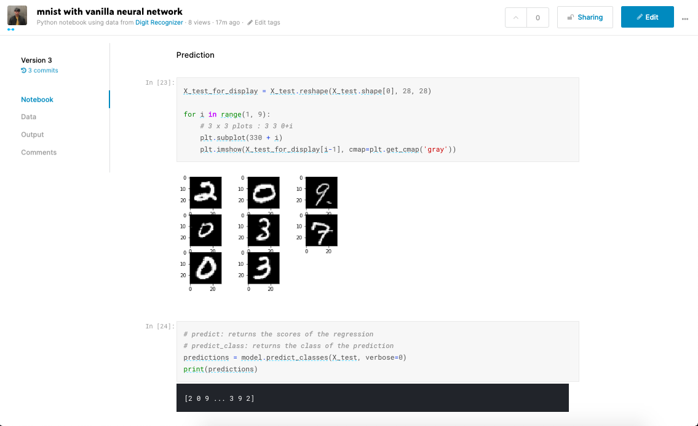

# Digit-Recognizer
Kaggle's "Digit-Recognizer" practice competition - building a vanilla NN model to get started

[link to source code](https://github.com/uoojin1/Digit-Recognizer/blob/master/mnist-with-vanilla-neural-network.ipynb)
[link to my kaggle kernel](https://www.kaggle.com/uoojin95/mnist-with-vanilla-neural-network)
